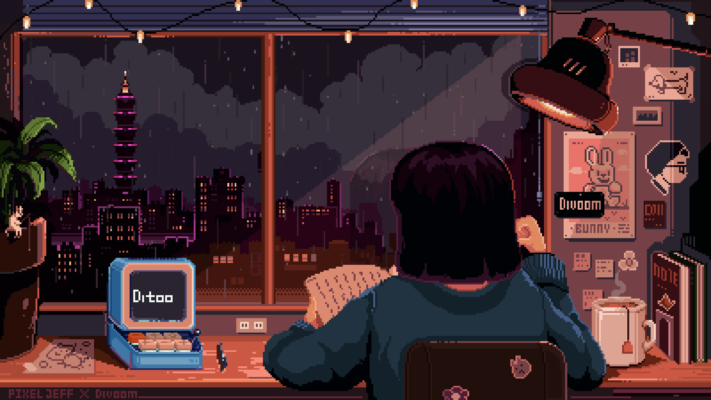

 <div align="center">
  <a href="https://git.io/typing-svg">
    
  </a>
</div>

 # I'm Isabella Da Silva :)

```cpp
class Developer {
    public:
        string name = "Isabella Da Silva";
        string role = "Software Developer";
        string passion = "Learning, travelling, and great food!";

        void skills() {
            cout << "Languages I Work With: Java, JavaScript, PHP, C++, C#, SQL" << endl;
            cout << "Frameworks & Tools I Use: Node.js, React.js, MySQL, Git, IntelliJ IDEA, VS Code, Linux" << endl;
            cout << "Currently expanding my experience with Java, Spring Boot and Angular" << endl;
        }

        void funFact() {
            cout << "Fun Fact: I dream of working from a beach..."
                 << " but in reality, it's usually me debugging at 3AM with coffee nearby." << endl;
        }

        void philosophy() {
            cout << "// Life's philosophy" << endl;

            if (hardwork() && coffee() > 2) {
                success();
            } else {
                cout << "Time to make another cup of coffee" << endl;
                struggle();
            }
        }

        // Yes, I am obsessed with coffee. No, I don't plan on stopping.
}; 
```

---


<h3 align="left">Connect with me!</h3>

[](mailto:isachristina429@gmail.com)
[](https://www.linkedin.com/in/belladasilva/)


<h3 align="left">My Stack ~</h3>

<div align="left">
  
  
  
  
  
  
  
  
  
  
  
  
  
  
  
  
  
  
  
  
  
  
  
  
  
</div>

---

<div align="center">
  
</div>

---
